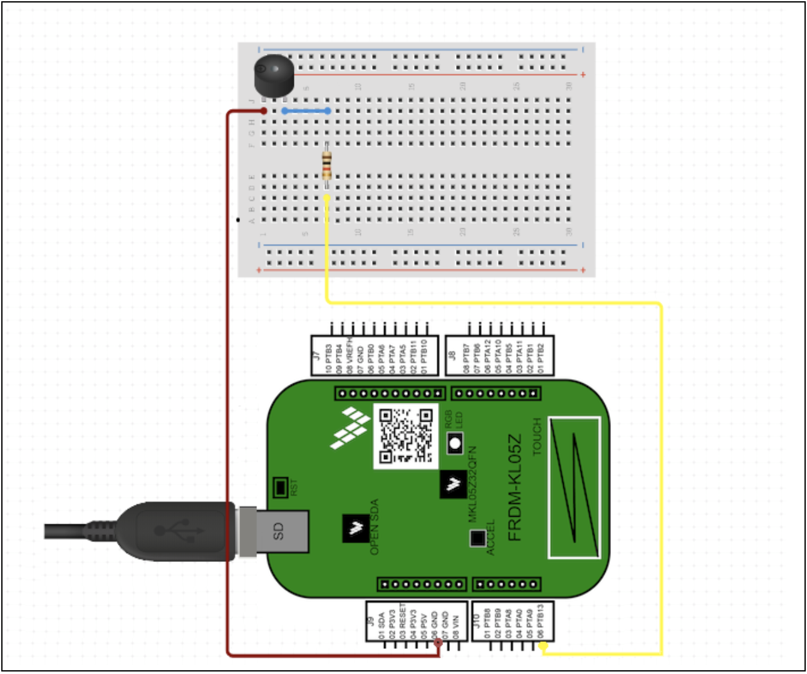

# MKL05_Alarm_Clock
This is a final academic project for the *Microprocessor Programming Techniques* module. The Keil uVision5 environment is used with FRDM-KL05Z board from NXP. It's a bare-metal programming style project in C language.
## Schematic

An external buzzer connected through the resistor is used. The buzzer is connected to pin 6 (GND) and Port B 13 as a GPIO output to turn it on. A simple schematic is provided below.




### Prerequisites
```
1. Keil MDK uVision5 environment is used to program the device, also a complete and configurated project file is provided with .uvprojx extension.
2. The user interface is provided through UART communication, so the user needs to use some serial port terminal (such as Termite or PuTTy).
3. Current PEmicro drivers
4. PEmicro Debug-App bootloader
```

### Usage
During startup user should configure through UART terminal current date and time in following format:
```
<day>/<month>/<year>|<hour>:<min>:<sec>
```

Example:

```
17/01/20|16:20:00
```
After that, the user has two input options:
```
s – to set an alarm
t – to display current hour
```
When the alarm is properly set, two additional options are available:
```
c – to check alarm date and hour
r – to delete existing alarm
```
When the alarm finally is triggered:
```
a – to stop alarm
d – to set the snooze
```

## Authors

* **Kamil Kaliś**: [kamkali](https://github.com/kamkali)
* **Radosław Skałbania**: [radekska](https://github.com/radekska)
